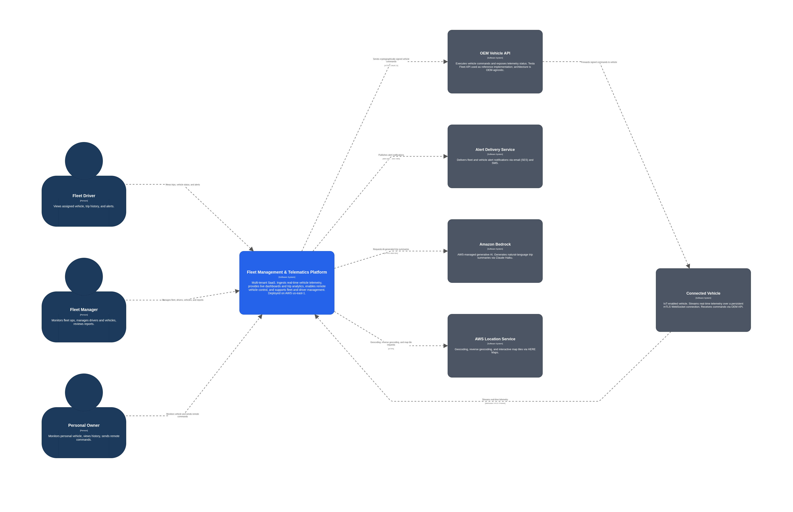
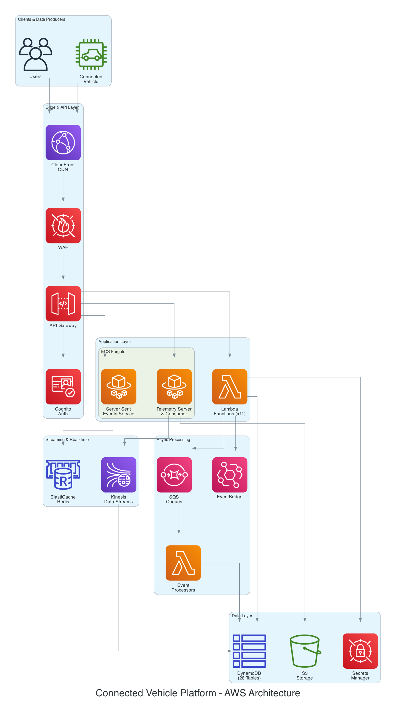

# Event Driven Vehicle Telematics Platform (AWS Reference Architecture)
> Author: Darian Duran | [LinkedIn](https://linkedin.com/in/darianduran)

---

This guidance demonstrates how I designed and deployed a production level and near real-time vehicle telematics platform on AWS. This solution is capable of ingesting thousands of events per second from connected vehicles and process them with subsecond latency. While there are many possible use-cases with this capability, I sought to build a platform where personal vehicle owners and fleet managers can view the status of their vehicles, interact with it using vehicle commands, and be provided with important insights based on event ingestion.

I will be using [Tesla's Fleet Telemetry](https://github.com/teslamotors/fleet-telemetry) as the reference vehicle data source. While Tesla specific components are used in the ingestion layer, the architecture still applies to other high throughput telemetry sources with minimal adjustments.

> **Scope:** While this repository will contain Terraform IaC, the overall goal of this repository is to showcase architecture design, decisions, and documentation. Function and service source code will be released in a separate repository linked below in the near future. In the meantime, I am happy to walk through the current implementations privately upon request.

---

## Table of Contents
- [Event Driven Vehicle Telematics Platform (AWS Reference Architecture)](#event-driven-vehicle-telematics-platform-aws-reference-architecture)
  - [Table of Contents](#table-of-contents)
  - [1. Use Case](#1-use-case)
  - [2. System Context \& High Level Architecture](#2-system-context--high-level-architecture)
    - [C4 Level 1 - System Context Diagram](#c4-level-1---system-context-diagram)
      - [System Overview](#system-overview)
      - [Users](#users)
      - [External Services](#external-services)
    - [High-Level AWS Architecture Diagram](#high-level-aws-architecture-diagram)
  - [3. Key Design Highlights](#3-key-design-highlights)
  - [4. Cost at Scale](#4-cost-at-scale)
  - [5. Installation Prerequisites](#5-installation-prerequisites)
    - [Tooling](#tooling)
    - [AWS Account Setup](#aws-account-setup)
  - [6. Installation](#6-installation)
    - [Bootstrap Remote State](#bootstrap-remote-state)
    - [Deploy Development Environment](#deploy-development-environment)
    - [Build and Push Container Images](#build-and-push-container-images)
    - [Update ECS Services](#update-ecs-services)
  - [7. Deployment Validation](#7-deployment-validation)
  - [8. Repository Structure](#8-repository-structure)
  - [9. Documentation Index](#9-documentation-index)
  - [10. Architecture Decision Records](#10-architecture-decision-records)
  - [11. Cleanup](#11-cleanup)

---

## 1. Use Case
At its foundation telematics-powered platforms must be capable of ingesting high volume telemetry data from concurrent clients and process them in real-time. In addition, customer data must be durable, accurate, and secure.

| Challenge | Scale |
|-----------|-------|
| Inbound telemetry throughput | Events per second can reach tens of thousands per fleet at peak |
| Processing latency requirement | < 2 seconds end-to-end |
| Data consumers | Real-time dashboards, trip analytics, alerts, command APIs |
| Tenant isolation | Strict boundaries between fleet organizations |
| Compliance surface | Audit logging, PII pseudonymization, encryption at rest and in transit |

Full requirements and SLAs are referenced in the [Requirements Documentation](docs/02-requirements.md).

---

## 2. System Context & High Level Architecture

### C4 Level 1 - System Context Diagram



This C4 Level 1 System Context diagram provides a high level overview of the system, the users who interact with it, and the external systems it integrates with. It helps provide an understanding of the system’s scope, boundaries, and relationships with external services. This diagram can be used to create a visual and shared outlook of system requirements. 

#### System Overview
The platform provides real-time monitoring and management of connected vehicles. The platform ingests telemetry data from vehicles, translates telemetry data into operational insights, and enables users to execute commands to control their vehicles remotely.

#### Users
- **Fleet Manager** – Owns and manages a fleet of vehicles. This role has administrative control over fleet operations, including monitoring vehicle activity, managing drivers, and reviewing operational reports.
- **Fleet Driver / Operator** – A member of a fleet organization with minimal permissions. Drivers can view their assigned vehicle, trip history, and alert notifications.
- **Personal Vehicle Owner** – An individual user who manages their own vehicle outside of any fleet organization. They can monitor vehicle status, view driving history, and issue remote vehicle commands.
  
#### External Services
- **OEM Vehicle API** - A secure tunnel between the platform and connected vehicles is established and allows remote command execution.
- **Connected Vehicle** - The vehicle that streams telemetry data and executes commands.
- **Alert Delivery Service** - Sends critical alerts  and notifications to users through SMS or email.
- **AWS Location Services** - Provides map capabilities with real-time and historic views.
- **AWS Bedrock** - Supports AI-driven summaries and insights for vehicle telemetry.

### High-Level AWS Architecture Diagram


The architecture can be broken into 5 different layers for a high-level overview. For the full architecture breakdown, reference [Solution Architecture Documentation](docs/03-solution-architecture.md).

---

## 3. Key Design Highlights
| Highlight | Summary |
|-----------|---------|
| Event-driven ingestion | Kinesis Data Streams with per-vehicle ordering and 7-day replay |
| Real-time processing | Go-based ECS Fargate Consumer parses Protobuf, pseudonymizes VINs, detects trip boundaries |
| Sub-second dashboards | Redis pub/sub → Server-Sent Events to browser clients |
| Multi-tenant isolation | Four independent layers: auth, API, data partitioning, real-time subscriptions ([5](docs/05-security-and-compliance.md)) |
| VIN pseudonymization | HMAC-SHA256 at the ingestion boundary — raw VINs never reach application databases ([ADR-007](adrs/007-vin-pseudonymization-at-ingestion.md)) |
| Defense-in-depth | 8-layer security model with STRIDE threat analysis ([§5](docs/05-security-and-compliance.md), [Appendix B](docs/appendix-b-risk-register.md)) |
| Production-grade IaC | 26 Terraform modules for networking, compute, storage, security, and observability |
| Operational maturity | 4 SLOs with error budget policy, 5 runbooks, structured logging with correlation IDs ([§9](docs/09-operations-and-support.md)) |
| Resilient processing | 3-tier trip safety net, Kinesis 7-day replay, DLQs on all queues, SSE → API polling fallback ([§7](docs/07-business-continuity-and-dr.md)) |
| 7 ADRs | Every significant design choice documented with context, alternatives, and rationale |

---

## 4. Cost at Scale
| Fleet Size | Monthly Cost | Cost Per Vehicle |
|------------|-------------|-----------------|
| 100 vehicles | ~$150 | $1.50 |
| 1,000 vehicles | ~$220 | $0.22 |
| 10,000 vehicles | ~$620 | $0.062 |
| 50,000 vehicles | ~$1,730 | $0.035 |

Fixed costs (WAF, GuardDuty, KMS, base compute) amortize across the fleet; variable costs (Kinesis, DynamoDB, S3) scale linearly. For per-service breakdowns, optimization strategies, and scaling triggers, see [Cost Analysis](docs/10-cost-analysis.md).

---

## 5. Installation Prerequisites

### Tooling

| Tool | Version | Purpose |
|------|---------|---------|
| [Terraform](https://developer.hashicorp.com/terraform/install) | >= 1.9 | Infrastructure provisioning |
| [AWS CLI](https://aws.amazon.com/cli/) | >= 2.x | AWS authentication and deployment |
| [Docker](https://docs.docker.com/get-docker/) | >= 24.x | Building and pushing container images to ECR |
| [Go](https://go.dev/dl/) | >= 1.21 | Telemetry Consumer service |
| [Node.js](https://nodejs.org/) | >= 20 | Lambda functions and SSE server |
| [jq](https://stedolan.github.io/jq/) | Any | Parsing CLI output in scripts |

### AWS Account Setup

- AWS account with permissions to create VPCs, ECS clusters, DynamoDB tables, Lambda functions, and IAM roles
- AWS CLI configured with credentials (`aws configure` or environment variables)
- Verify sufficient quota is available if the account has already been in use
- Register a domain via Route53 or external registar
- ACM certificate in `us-east-1` (required by CloudFront)
- An AWS Organizations setup is recommended for environment isolation

---

## 6. Installation
### Bootstrap Remote State

```bash
cd iac/bootstrap
terraform init
terraform apply
```

### Deploy Development Environment

```bash
cd iac/envs/{environment}
cp terraform.tfvars.example terraform.tfvars
vim terraform.tfvars # Add in your values
terraform init
terraform plan -out=tfplan
terraform apply tfplan
```

### Build and Push Container Images

```bash
aws ecr get-login-password --region us-east-1 \
  | docker login --username AWS --password-stdin <account-id>.dkr.ecr.us-east-1.amazonaws.com

for service in telemetry-server telemetry-consumer sse-server; do
  docker build -t $service ./src/$service
  docker tag $service:latest <account-id>.dkr.ecr.us-east-1.amazonaws.com/fleet-dev-$service:latest
  docker push <account-id>.dkr.ecr.us-east-1.amazonaws.com/fleet-dev-$service:latest
done
```

### Update ECS Services

```bash
for service in telemetry-consumer telemetry-server sse-server; do
  aws ecs update-service \
    --cluster fleet-dev-cluster \
    --service fleet-dev-$service \
    --force-new-deployment
done
```
---

## 7. Deployment Validation

```bash
# ECS services are RUNNING
aws ecs describe-services \
  --cluster fleet-dev-cluster \
  --services fleet-dev-telemetry-consumer fleet-dev-telemetry-server fleet-dev-sse-server \
  --query 'services[*].{name:serviceName,desired:desiredCount,running:runningCount,status:status}'
```

---

## 8. Repository Structure

----

## 9. Documentation Index

| Document | What it covers |
|----------|----------------|
| [Executive Summary](docs/01-executive-summary.md) | Business context, solution overview, key benefits |
| [Requirements](docs/02-requirements.md) | Functional/non-functional requirements, constraints, assumptions, SLAs |
| [Solution Architecture](docs/03-solution-architecture.md) | Component breakdown, network topology, security architecture, integration points |
| [Technical Design](docs/04-technical-design.md) | DynamoDB schemas, event flows, sequence diagrams, API specs |
| [Security & Compliance](docs/05-security-and-compliance.md) | VIN pseudonymization, encryption, RBAC, multi-tenancy, audit logging |
| [Performance & Scalability](docs/06-performance-and-scalability.md) | Throughput calculations, scaling triggers, capacity planning |
| [Business Continuity & DR](docs/07-business-continuity-and-dr.md) | RTO/RPO targets, backup strategy, failover procedures, graceful degradation |
| [Implementation Plan](docs/08-implementation-plan.md) | CI/CD pipelines, deployment strategies, environment parity, rollback |
| [Operations & Support](docs/09-operations-and-support.md) | Golden signals, dashboards, alerting, SLOs, error budget policy |
| [Cost Analysis](docs/10-cost-analysis.md) | Per-service breakdowns, optimization strategies, budget controls |
| [Appendix A](docs/appendix-a-design-decisions.md) | Well-Architected self-assessment, ADR index, improvement backlog |
| [Appendix B](docs/appendix-b-risk-register.md) | STRIDE threat analysis across all trust boundaries |
| [Glossary](docs/glossary.md) | Domain and technical terminology |
| [SLOs](ops/slos/slos.md) | SLO definitions with measurement methodology |
| [Runbooks](ops/runbooks/) | Operational procedures for known failure modes |

---

## 10. Architecture Decision Records

| ADR | Decision | Status |
|-----|----------|--------|
| [ADR-001](adrs/001-fargate-spot-for-sse.md) | Fargate Spot for interruption-tolerant SSE workloads | Accepted |
| [ADR-002](adrs/002-api-gateway-lambda-over-fargate.md) | API Gateway + Lambda over Fargate for REST API | Accepted |
| [ADR-003](adrs/003-ecs-fargate-over-eks.md) | ECS Fargate over EKS for container orchestration | Accepted |
| [ADR-004](adrs/004-lambda-vs-fargate-decision-matrix.md) | Compute selection matrix: Lambda vs Fargate | Accepted |
| [ADR-005](adrs/005-dynamodb-multi-table-design.md) | Multi-table DynamoDB design over single-table | Accepted |
| [ADR-006](adrs/006-redis-for-realtime-pubsub.md) | ElastiCache Redis as ephemeral real-time layer | Accepted |
| [ADR-007](adrs/007-vin-pseudonymization-at-ingestion.md) | VIN pseudonymization at the ingestion layer | Accepted |

---

## 11. Cleanup

```bash
# Destroy environments in reverse order
cd iac/envs/prod && terraform destroy
cd iac/envs/dev && terraform destroy
cd iac/bootstrap && terraform destroy
```

> S3 buckets with versioning and DynamoDB tables with deletion protection must be manually emptied/disabled before `terraform destroy` succeeds in production. This is intentional.
