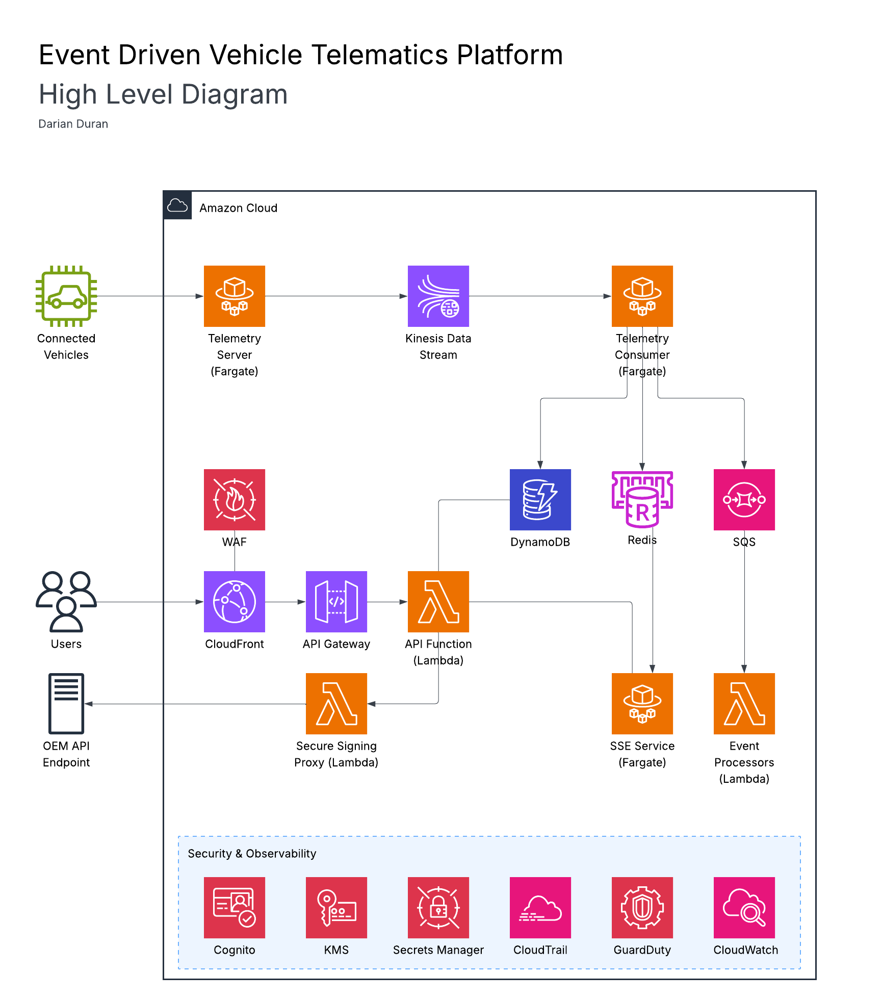
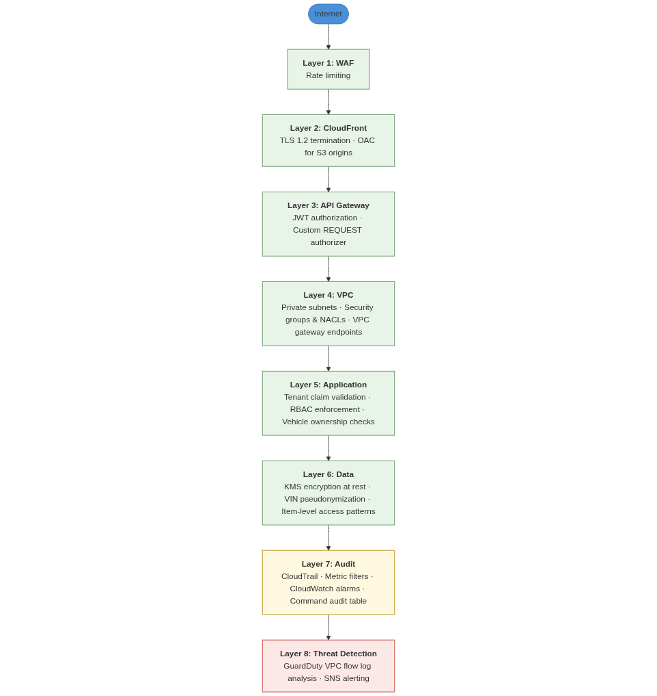

# 3.0 Solution Architecture

## 3.1 High-Level Architecture

### 3.1.1 Architecture Diagram

### 3.1.2 AWS Services

#### Edge & API Layer
| Service | Role | Description |
|---|---|---|
| CloudFront | CDN | Routes traffic to appropriate origin and provides TLS termination |
| AWS WAF | Edge Security Control | Provides managed rules and abuse rate-limitting controls |
| AWS API Gateway | API Layer | Provides API processing and integrations enable authentication of requests |
| Cognito | API & User Authentication | User pool manages userbase of platform and enables JWT token validation |

#### Compute & Containers
| Service | Role | Description |
|---|---|---|
| ECS Fargate | Container Management | Runs containerized services without managing infrastructure |
| ECR | Image storage | Secure container image registry |
| Lambda | Event Driven Functions | Handles API logic, async jobs, and token processing |

#### Networking & Service Discovery
| Service | Role | Description |
|---|---|---|
| NLB | Load Balancing | Provides a load balanced and secure internet ingress for private subnet compute resources |
| Cloud Map | Private DNS | Enables ability of ECS services to discover and communicate with eachother |

#### Streaming & Messaging
| Service | Role | Description |
|---|---|---|
| Kinesis Data Stream | Telemetry Ingestion | Real-time and durable data stream |
| SQS | Job Queue | Decouples processing and prevents processing clogs with DLQs |
| SNS | Alert Delivery Service | Sends security alerts to internal members and operational alerts to users |
| EventBridge | Event Scheduler | Schedules reoccuring tasks |

#### Data Stores & Caching
| Service | Role | Description |
|---|---|---|
| DynamoDB | Primary Data Store | Low latency and managed database |
| Redis | Real-time state storage | Low latency vehicle data for SSE workflow |
| S3 | Stores static assets and archives | Stores logs, media, and archived telemetry data | 

#### Security & Encryption
| Service | Role | Description |
|---|---|---|
| Secrets Manager | Secret Artifact Management | Manages private keys, client secrets, etc |
| SSM Parameter Store | Runtime Config Management | Centralized location for compute environment variables |
| KMS | Encryption Keys | Customer managed keys for resource-level data protection |
| ACM | TLS Certificates | Automated certificate issuances and renewal |

#### Observability & Security Monitoring
| Service | Role | Description |
|---|---|---|
| CloudWatch | Metrics, Logs, & Alarms | Provides dashboards of logs and metrics, and alarm on events |
| CloudTrail | Audit Trail | Records all API activity and alarms on sensitive operations |
| Guard Duty | Security Monitoring | Detects threats from VPC flow logs and events |

#### Enrichment Services
| Service | Role | Description |
|---|---|---|
| Bedrock | Analytics Summarization | Generates simplified analytic summaries. | 
| Location Services | Mapping | Enables mapping and routing for user's dashboards |

#### Governance & Cost Management
| Service | Role | Description |
|---|---|---|
| Organizations | Governance | Enforces policies across accounts and enables environment isolation |
| AWS Budgets | Budget Alerts | Cost threshold monitoring and alerting |

---

## 3.2 Network Architecture
| Subnet Tier | Resources |
|---|---|
| Public (2) | NLB, NAT Gateway |
| Private (2) | ECS Fargate tasks, VPC-attached Lambda, ElastiCache Redis |

NLB forwarding rules:
| Port | Target | Purpose |
|---|---|---|
| 443 (TCP) | Telemetry Server | mTLS passthrough |
| 3000 (TCP) | SSE Server | Server-Sent Events streaming via CloudFront |

Gateway/Interface Endpoints:
| Endpoint | Purpose |
|---|---|---|
| S3 & DynamoDB Gateway Endpoints | Provides free and secure access to data stores stored in AWS Public Zone. Avoids NAT data processing fees |
| Kinesis Interface Endpoint | Provides a dedicated path from the private subnet applications to Kinesis. Avoids NAT data processing fees |

---

## 3.3 Security Architecture Overview

Security is enforced at eight independent layers. A compromise at any single layer does not expose sensitive data. Key controls at the architecture level:

- VIN pseudonymization (HMAC-SHA256) at ingestion prevent raw VIN storage in application databases or logs
- Cognito JWT with tenant claims (`organizationId`, `role`, `pseudoVINs`)
- Service IAM roles are scoped to the exact resource it requires (least privileges)
- SCPs enforcing region restriction, instance type limits, root account denial, and MFA for destructive actions
- CloudTrail with 7 metric filters and alarms monitoring sensitive operations
