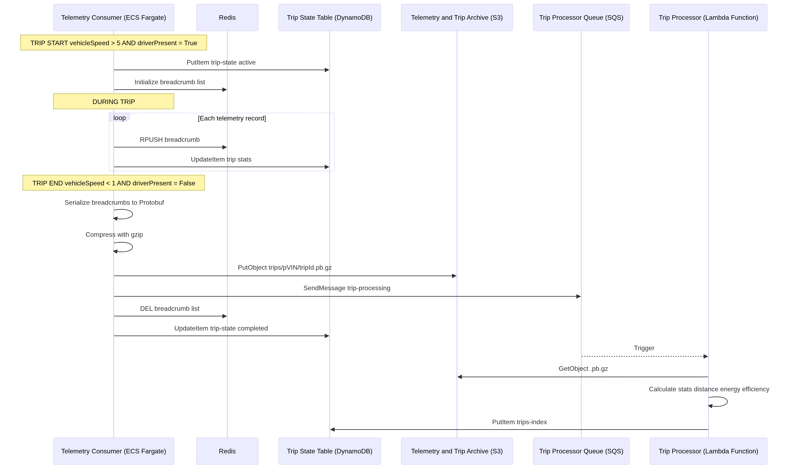
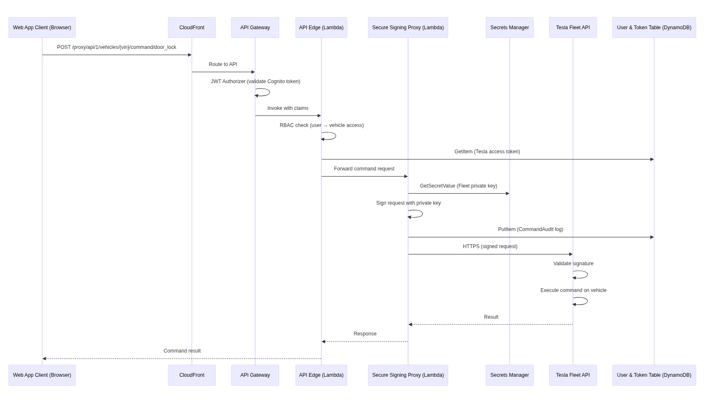

# 4.0 Technical Design

## 4.1 Detailed Architecture Components

### 4.1.1 Telemetry Ingestion Pipeline

**Telemetry Server (ECS Fargate)** - Establishes a persistent and mTLS secure WebSocket connection to vehicles. Accepts incoming messages and writes them as records to Kinesis and uses the raw VIN as the partition key. Loads TLS private key from Secrets Manager and runtime configuration variables from SSM Parameter store. 

**Fleet Consumer (ECS Fargate)** - Primary data stream processor. Pulls batches of records from Kinesis and fans out to multiple targets:

| Event Type | DynamoDB Target | Redis Action | SQS/SNS Action |
|---|---|---|---|
| Vehicle state update | `vehicle-state` | SET + PUBLISH | — |
| Trip start (speed > threshold) | `trip-state`, `live-breadcrumbs` | PUBLISH | — |
| Trip breadcrumb (active trip) | `live-breadcrumbs` | PUBLISH | — |
| Trip end (speed < threshold) | `trip-state` (close), `trips-index` | — | S3 archive + SQS Trip Processing |
| Charging session | `charging-soc` | SET + PUBLISH | — |
| Security event | `security-events` | — | SQS Geofence Check |
| Vehicle alert | `alerts` | — | SNS Critical Alerts (if severity warrants) |
| Vehicle error, connectivity, & metrics| `errors`, `connectvitiy`, `metrics` | — | — |

The consumer also applies pseudonymization against the VIN before any delivery to targets. Runtime configurations are managed in SSM Parameter store.

**Kinesis Data Stream** - A single stream is utilized in on-demand mode with 7 day archival. KMS-managed key utilized to encrypt the stream.

### 4.1.2 Trip Processing Pipeline

#### 4.1.2.1 Trip Detection State Machine

Trip analytics are designed to be unique and session-based. The trips are detected using a speed based state machine with three configurable thresholds managed in SSM parameter store:

| Parameter | Default | Purpose |
|---|---|---|
| `tripStartSpeedMph` | 5 mph | Speed above which a trip begins |
| `tripEndSpeedMph` | 1 mph | Speed at or below which a trip may be ending |
| `tripGapDetectionSeconds` | 300s | Duration speed must remain below end threshold to confirm trip end |

- **IDLE → ACTIVE:** Vehicle speed exceeds `tripStartSpeedMph` and no active trip exists for this pseudoVIN. The Consumer creates a `trip-state` record with `status=active`, generates a unique `tripId`, and begins recording breadcrumbs.
- **ACTIVE → ENDING:** Vehicle speed drops below `tripEndSpeedMph`. A gap timer starts counting. Breadcrumbs continue to be recorded during this phase.
- **ENDING → ACTIVE:** Vehicle speed rises above `tripStartSpeedMph` before the gap timer expires. The gap timer is cancelled and the trip continues.
- **ENDING → IDLE (trip end):** The gap timer reaches `tripGapDetectionSeconds` without speed exceeding the start threshold. The trip is finalized.

#### 4.1.2.2 S3 Archive Format

The trip archive stored at `trips/{pseudoVIN}/{tripId}.gz` is a gzipped JSON array:

```json
[
  {
    "timestamp": "2025-03-05T14:32:01.000Z",
    "lat": -105.01981255760771,
    "lng": -122.4194,
    "vehicleSpeed": 73.5,
    "heading": 90,
    "odometer": 22683.6,
    "batteryLevel": 75,
    "batteryRange": 255.3,
    "shiftState": "D",
    ...
  }
]
```

#### 4.1.2.3 Trip Processor
The trip processor is a Lambda function that pulls the gzip archive from S3, decompresses it, and computes the following data: 

**Summary metrics:**

| Metric | Computation |
|---|---|
| `distanceMiles` | Sum of distance between the first and last breadcrumb |
| `durationMinutes` | `endTime - startTime` |
| `maxSpeedMph` | Highest speed value across all breadcrumbs |
| `avgSpeedMph` | Average speed value across all breadcrumbs |
| `startBattery` / `endBattery` | First and last `batteryLevel` values |
| `originLocation` / `destinationLocation` | First and last `{lat, lng}` pairs. Reverse-geocoded for human readable locations |

**Safety event detection:**

| Event Type | Detection Logic | Threshold (configurable via SSM) |
|---|---|---|
| Excessive Speeding | `vehicleSpeed > speedLimitMph` | Default: 85 mph |
| Hard braking | Speed delta between consecutive records exceeds deceleration G-force threshold | Default: -0.45g |
| Hard acceleration | Speed delta exceeds acceleration G-force threshold | Default: 0.40g |
| Aggressive turn | Speed delta exceeds G-force threshold when making left or right turns | Default: 0.40g |

**Driving score:** A 0–100 composite score computed as: `100 - (speedingPenalty + brakingPenalty + accelerationPenalty + turningPenalty)`.

**AI trip summary (optional):** If enabled, the gzip is also sent to Bedrock and processed by Claude Haiku to generate a natural language trip summary.

The final trip artifact:
```json
{
  "pseudoVIN": "a1b2c3...",
  "tripId": "trip_20250305_143201_a1b2c3",
  "tripDate": "2025-03-05",
  "startTime": "2025-03-05T14:32:01.000Z",
  "endTime": "2025-03-05T15:04:33.000Z",
  "startLocation": { "lat": X, "lng": Y, "address": "Street Name, City, State" },
  "endLocation": { "lat": X, "lng": Y, "address": "Street Name, City, State" },
  "distanceMiles": 8.3,
  "durationMinutes": 32.5,
  "maxSpeedMph": 45.2,
  "avgSpeedMph": 22.1,
  "energyConsumedKwh": 3.8,
  "startBattery": 78,
  "endBattery": 74,
  "breadcrumbCount": 1847,
  "drivingScore": 88,
  "safetyEvents": [
    { "type": "hard_braking", "timestamp": "2025-03-05T14:45:12.000Z", "lat": X, "lng": Y, "severity": "moderate" }
  ],
  "aiSummary": "32 minute commute from...",
  "s3ArchiveKey": "trips/a1b2c3.../trip_20250305_143201_a1b2c3.gz",
  "processedAt": "2025-03-05T15:05:01.000Z"
}
```
### 4.1.3 Geofence and Security Service

**Geofence Evaluator Lambda Function (Python):** Triggered by SQS Geofence Check queue. Loads user geofence definitions from DynamoDB, performs checks on breadcrumb, tracks enter/exit state transitions in `geofence-state`. On boundary crossings, writes an event and publishes to user via SNS.

### 4.1.4 Dashcam Media Storage Service

**Dashcam Processor Lambda Function (Python):** Triggered by SQS Dashcam Processing queue. Processes uploaded dashcam video files from S3. Handles transcoding, compression, and thumbnail generation.

S3 dashcam bucket lifecycle: Original quality footage is stored in `raw/` for 7-days and then deleted. A compressed version is then stored in `webview/` for 90 days. After 90 days it is transitioned to `archive/` via Intelligent-Tiering and ends in Glacier IR at 180 days.

### 4.1.5 Secure Signing Proxy Lambda Function (Go)
Securely signs and forwards vehicle commands to the OEM API endpoint. The function utilizes an OEM trusted privacy key that is loaded from Secrets Manager and cached in memory. Every command that is processed gets audited/logged in the `command-audit` DynamoDB table with the username, pseudoVin, command, result, and user agent. 

### 4.1.6 Real-Time Streaming Service
**SSE Service (ECS Fargate Spot):** Authenticates incoming connections using Cognito tokens and verifies vehicle ownership via the `oem-tokens` DynamoDB table. Subscribes to Redis channel to recieve the vehicle data stream. Runs in Fargate Spot mode for cost optimization due to auto reconnecting capabilities and fallbacks.

## 4.2 API Design
### 4.2.1 Access Token Service

Two Lambda functions implement resource-scoped authorization:

- **Token Generator:** Verifies vehicle ownership by pseudoVin, issues a temporary token (15 minute expiration), and generates CloudFront signed URLs for direct S3 delivery.
- **Token Authorizer:** Validates token signature, expiration, and resource scope on protected API routes. Results cached for 5 minutes.

## 4.3 Data Flow Diagrams

### 4.3.1 Telemetry Ingestion Flow


### 4.3.2 Trip Lifecycle



### 4.3.3 Vehicle Command Flow




### 4.3.4 Real-Time SSE Connection Flow


