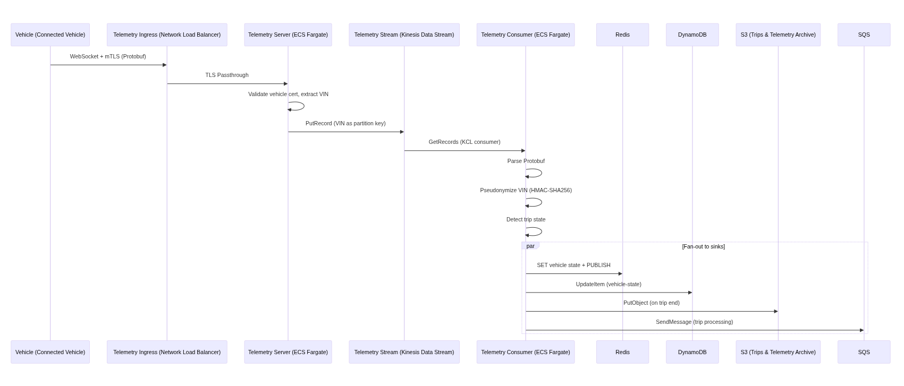
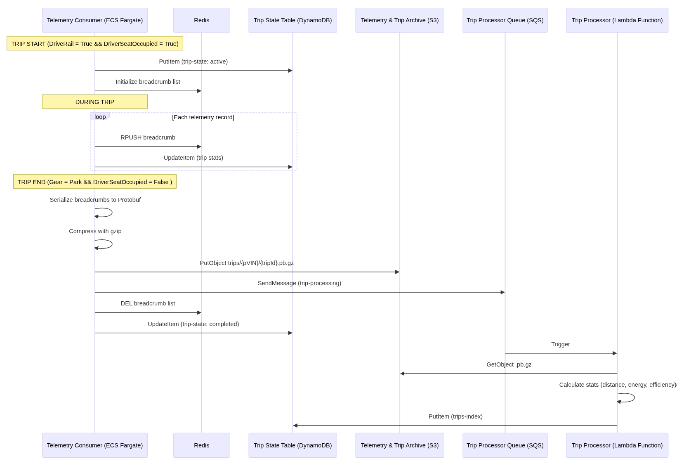
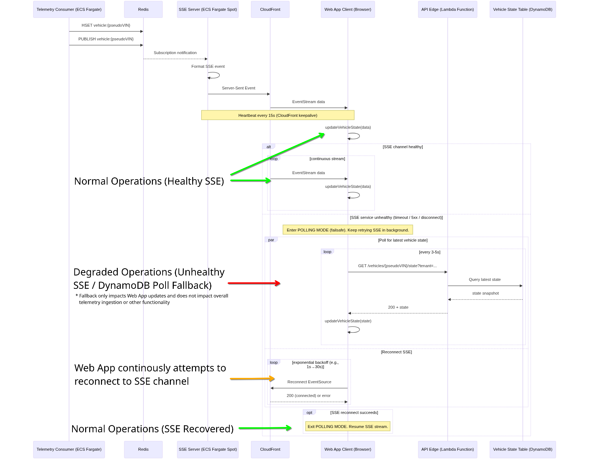

# 4.0 Technical Design

## 4.1 Detailed Architecture Components

### 4.1.1 Telemetry Ingestion Pipeline

**Fleet Telemetry Server (ECS Fargate Service)**
Accepts mTLS WebSocket connections from connected vehicles. Writes Protobuf format events to Kinesis Data Stream with the VIN as the partition key. TLS certificate and private key are loaded from Secrets Manager. SSM parameter values provide configuration variables for log level and rate limit caps.

**Fleet Consumer (ECS Fargate — Go)**
Pulls batches of records from the Kinesis data stream and processes data to multiple storage and messaging targets:

| Message Type | DynamoDB Target | Redis Action | SQS/SNS Action |
|---|---|---|---|
| Vehicle state update | `vehicle-state` | SET + PUBLISH | — |
| Trip start (speed > threshold) | `trip-state`, `live-breadcrumbs` | Breadcrumb PUBLISH | — |
| Trip breadcrumb (active trip) | `live-breadcrumbs` | Breadcrumb PUBLISH | — |
| Trip end (speed < threshold) | `trip-state` (close), `trips-index` | — | S3 archive + SQS Trip Processing |
| Charging session | `charging-soc` | SET + PUBLISH | — |
| Security event | `security-events` | — | SQS Geofence Check |
| Vehicle alert | `alerts` | — | SNS Critical Alerts (if severity warrants) |
| Vehicle error | `errors` | — | — |
| Connectivity status | `connectivity` | SET + PUBLISH | — |
| Vehicle metrics | `metrics` | — | — |

All VINs are pseudonymized via HMAC-SHA256 before any downstream write. Tunables (via SSM): Kinesis iterator type, batch size, poll interval, trip start/end speed thresholds, speed limit, gap detection seconds.

**Kinesis Data Stream**
Provides real-time telemetry data transfer and integrates natively with the architecture. Operates in on-demand mode with auto scaling shards and KMS encryption. 7-day retention window allows for a durable buffer for outage recovery and replay without the need for dedicated archive storage.

### 4.1.2 Trip Processing Pipeline

#### 4.1.2.1 Trip Detection State Machine
The Telemetry Consumer maintains an in-memory trip state per vehicle. Trip boundaries are detected using a speed-based state machine with three configurable thresholds:
| Parameter | Default | Purpose |
|---|---|---|
| `tripStartSpeedMph` | 5 mph | Speed above this threshold begins a trip |
| `tripEndSpeedMph` | 1 mph | Speed below this threshold commences trip-end countdown  |
| `tripGapDetectionSeconds` | 300s | Duration speed must remain below end threshold to confirm trip end |

- **IDLE → ACTIVE:** Vehicle speed exceeds `tripStartSpeedMph` and no active trip exists for the vehicle. The Consumer creates a `trip-state` record with `status=active`, generates a unique `tripId`, and begins recording breadcrumbs.
- **ACTIVE → ENDING:** Vehicle speed drops below `tripEndSpeedMph`. A gap timer starts counting. Breadcrumbs continue to be recorded during this phase.
- **ENDING → ACTIVE:** Vehicle speed rises above `tripStartSpeedMph` before the gap timer expires. The gap timer is cancelled and the trip continues.
- **ENDING → IDLE (trip end):** The gap timer reaches `tripGapDetectionSeconds` without speed exceeding the start threshold. The trip is finalized.

#### 4.1.2.2 Data Stores During Trip Lifecycle

Each phase of a trip's lifecycle writes to different data stores for different purposes:

| Phase | Data Store | Record | Purpose |
|---|---|---|---|
| Trip start | DynamoDB `trip-state` | `{pseudoVIN, tripId, status: "active", startTime, startLocation}` | Tracks active trip state; used by Fallback Scanner to detect orphans |
| Active (each telemetry record) | DynamoDB `live-breadcrumbs` | `{pseudoVIN, tripId, timestamp, lat, lng, speed, heading, altitude, odometer}` | Durable backup of breadcrumb trail; TTL-expired after trip is archived |
| Active (each telemetry record) | Redis PUBLISH | Channel: `breadcrumb:{pseudoVIN}`, payload: `{lat, lng, speed, heading, timestamp}` | Real-time fan-out to SSE Server for live map animation in browser |
| Trip end | DynamoDB `trip-state` | Update: `{status: "ended", endTime, endLocation, breadcrumbCount}` | Marks trip as complete; triggers archive and processing |
| Trip end | S3 telemetry bucket | Key: `trips/{pseudoVIN}/{tripId}.gz` — gzipped JSON array of all breadcrumb records | Durable archive of the full breadcrumb trail; source of truth for Trip Processor |
| Trip end | SQS Trip Processing queue | `{pseudoVIN, tripId, s3Key, breadcrumbCount, startTime, endTime}` | Triggers async trip processing |
| Post-processing | DynamoDB `trips-index` | Enriched trip record (see §4.1.2.4) | Queryable trip metadata and summary; the final source of truth for trip data |

Source of truth at each phase:
- **During active trip:** `trip-state` (active status) + `live-breadcrumbs` (DynamoDB, durable) + Redis (ephemeral, for live map only)
- **After trip end, before processing:** S3 archive is the authoritative breadcrumb source; `trip-state` shows `status=ended`
- **After processing:** `trips-index` is the authoritative trip record; S3 archive is retained for replay and audit

#### 4.1.2.3 S3 Archive Format

The trip archive stored at `trips/{pseudoVIN}/{tripId}.gz` is a gzipped JSON array:

```json
[
  {
    "timestamp": "2025-03-05T14:32:01.000Z",
    "lat": 37.7749,
    "lng": -122.4194,
    "speed": 32.5,
    "heading": 180,
    "altitude": 15.2,
    "odometer": 12345.6,
    "batteryLevel": 78,
    "batteryRange": 185.3,
    "shiftState": "D",
    "power": -12.5
  }
]
```

The archive contains every telemetry record received during the trip, ordered by timestamp. Average archive size: ~50 KB for a 30-minute trip (~1,800 records × ~28 bytes compressed per record).

#### 4.1.2.4 Trip Processor — Enrichment Pipeline

The Trip Processor Lambda downloads the S3 archive, decompresses it, and computes the following enriched record for `trips-index`:

**Summary metrics:**

| Metric | Computation |
|---|---|
| `distanceMiles` | Haversine distance between consecutive breadcrumb coordinates, summed |
| `durationMinutes` | `endTime - startTime` |
| `maxSpeedMph` | Maximum speed value across all breadcrumbs |
| `avgSpeedMph` | Mean speed across breadcrumbs where `speed > 0` |
| `energyConsumedKwh` | Integrated power draw across time intervals (from `power` field) |
| `startBattery` / `endBattery` | First and last `batteryLevel` values |
| `startLocation` / `endLocation` | First and last `{lat, lng}` pairs, reverse-geocoded to address strings |

**Safety event detection:**

| Event Type | Detection Logic | Threshold (configurable via SSM) |
|---|---|---|
| Speeding | `speed > speedLimitMph` for ≥ 3 consecutive records | Default: 80 mph |
| Hard braking | Speed delta between consecutive records exceeds deceleration G-force threshold | Default: -0.45g |
| Hard acceleration | Speed delta exceeds acceleration G-force threshold | Default: 0.40g |
| Aggressive turn | Heading delta between consecutive records exceeds turn rate threshold | Default: 45°/sec |

**Driving score:** A 0–100 composite score computed as: `100 - (speedingPenalty + brakingPenalty + accelerationPenalty + turningPenalty)`, where each penalty is proportional to the count and severity of detected safety events relative to trip duration.

The final `trips-index` record:

```json
{
  "pseudoVIN": "a1b2c3...",
  "tripId": "trip_20250305_143201_a1b2c3",
  "tripDate": "2025-03-05",
  "startTime": "2025-03-05T14:32:01.000Z",
  "endTime": "2025-03-05T15:04:33.000Z",
  "startLocation": { "lat": 37.7749, "lng": -122.4194, "address": "123 Main St, San Francisco, CA" },
  "endLocation": { "lat": 37.7849, "lng": -122.3994, "address": "456 Folsom St, San Francisco, CA" },
  "distanceMiles": 8.3,
  "durationMinutes": 32.5,
  "maxSpeedMph": 45.2,
  "avgSpeedMph": 22.1,
  "energyConsumedKwh": 3.8,
  "startBattery": 78,
  "endBattery": 74,
  "breadcrumbCount": 1847,
  "drivingScore": 88,
  "safetyEvents": [
    { "type": "hard_braking", "timestamp": "2025-03-05T14:45:12.000Z", "lat": 37.7799, "lng": -122.4100, "severity": "moderate" }
  ],
  "aiSummary": "25-minute commute from downtown SF to SoMa...",
  "s3ArchiveKey": "trips/a1b2c3.../trip_20250305_143201_a1b2c3.gz",
  "processedAt": "2025-03-05T15:05:01.000Z"
}
```

#### 4.1.2.5 Fallback Safety Net

A multi-stage pipeline ensures every completed trip is processed, even if the primary path fails:


- **Trip Processor (Lambda — Python):** Primary processing path. Triggered by SQS (batch size 5, partial batch failure reporting). Downloads the S3 archive, runs the enrichment pipeline described in §4.1.2.4, writes to `trips-index`. Concurrency limited to 10 to control downstream DynamoDB and Bedrock load.
- **Fallback Scanner (Lambda — Python):** Every 15 minutes, queries `trip-state` for trips with `status=active` and `lastUpdated` older than 30 minutes. These represent trips where the Consumer detected a start but never received an end signal (vehicle went offline, Consumer restarted). Finalizes the trip by writing the S3 archive from available breadcrumbs and enqueues for processing.
- **Batch Processor / Daily Catch-All (Lambda — Python):** Daily at 00:30 UTC. Lists S3 objects under `trips/` and cross-references against `trips-index` (via the `tripId-index` GSI). Any S3 archive without a corresponding `trips-index` entry is enqueued for processing. 15-minute timeout for large backlogs.
- **Dead Letter Queue:** Messages that fail processing after 3 attempts are moved to the Trip Processing DLQ with 14-day retention. Alarm triggers on DLQ depth > 0.
  
### 4.1.3 Geofence and Security Service

**Geofence Evaluator (Lambda — Python):** Triggered by SQS Geofence Check queue (batch size 10). Loads user geofence definitions from the `geofences` DynamoDB table, performs point-in-polygon evaluation, tracks enter/exit state transitions in `geofence-state`. On boundary crossings, writes a security event and publishes an alert to the SNS Critical Alerts topic.

### 4.1.4 Dashcam Service

**Dashcam Processor (Lambda — Python):** Triggered by SQS Dashcam Processing queue. Processes uploaded dashcam video files from S3. Handles transcoding or thumbnail generation. Memory: 3,008 MB. Timeout: 10 minutes.

S3 dashcam bucket lifecycle: `raw/` deleted after 7 days → `webview/` expired after 90 days → `archive/` tiered to Intelligent-Tiering at 30 days and Glacier IR at 180 days.

### 4.1.5 Gateway API (Lambda — Node.js)

The primary REST backend for the web console. Handles all operations not delegated to specialized Lambda functions:

- Authentication: User registration, login, token refresh via Cognito. OAuth 2.0 authorization code flow for vehicle OEM pairing.
- Vehicle data: Latest vehicle state, trip history, live breadcrumbs, charging sessions.
- Fleet management: CRUD for organizations, user invitations, vehicle assignments, driver profiles, driver-to-vehicle assignments.
- Maintenance: Service record management, maintenance alert tracking.
- Reports: Fleet report generation and retrieval, scheduled report configuration.
- Alerts: Consolidated alert center across vehicle, driver, maintenance, and security categories.
- Automations: User-defined scheduled commands and trigger-based automations.
- Security: Geofence CRUD, security event history, security settings.
- Dashcam: Event listing, video metadata retrieval.
- Location services: Geocoding, reverse geocoding, route calculation via AWS Location Service.

Handler modules: `handlers/fleet.js`, `handlers/rbac.js`, `handlers/automations.js`, `utils/email.js`, `utils/sampleData.js`.

### 4.1.6 Signing Proxy (Lambda — Go64)

Securely signs and forwards vehicle commands to the OEM Fleet API. The OEM private key is loaded from Secrets Manager and cached in-memory. Every command is audited in the `command-audit` DynamoDB table with userId, VIN, command, result, IP address, and user agent. Runs in a restricted security group (HTTPS and DNS egress only). Application-level validation ensures the destination matches the expected OEM API domain.

### 4.1.7 Real-Time Streaming Service

**Fleet SSE Server (ECS Fargate Spot — Node.js):** Authenticates incoming connections using Cognito tokens, verifies vehicle ownership via the `tesla-tokens` DynamoDB table, subscribes to Redis pub/sub channels for the user's vehicles, and streams position, speed, battery state, and other telemetry fields in real time. Runs on Fargate Spot — SSE connections are inherently reconnectable. See [ADR-001](../adrs/001-fargate-spot-for-sse.md).

**Redis (ElastiCache 7.0, cache.t4g.micro):** Acts as the real-time pub/sub backbone. The Fleet Consumer publishes live breadcrumbs and vehicle state updates to Redis channels. The SSE Server subscribes and pushes updates to connected browsers. Data is ephemeral with TTL-based expiration. Redis is explicitly not the system of record — DynamoDB is authoritative. See [ADR-006](../adrs/006-redis-for-realtime-pubsub.md).

### 4.1.8 Frontend Web Console

Key pages: Dashboard (fleet KPIs), Live Map (real-time positions via AWS Location Service / HERE Maps), Vehicles (state, controls, tire pressure), Trip Replay (breadcrumb animation, driving analytics, safety events), Charging (session history, energy analytics), Dashcam (event-based video viewer), Drivers (profiles, assignments, analytics), Maintenance (service records, alerts), Reports (PDF/Excel/CSV generation), Alert Center (consolidated alerts), Automations (rule-based builder), Settings (organization, RBAC, geofences), User Management (invitations, roles), Onboarding (account type selection, OEM OAuth pairing).

### 4.1.9 Scheduled and Background Processes

| Process | Schedule | Purpose |
|---|---|---|
| Fallback Scanner | Every 15 minutes | Detect and finalize orphaned trips |
| Daily Catch-All | Daily at 0030 UTC | Sweep for any unprocessed trip archives |
| DynamoDB TTL | Continuous | Auto-expire live breadcrumbs, alerts, errors, metrics, command audit records, invitation tokens |
| S3 Lifecycle | Continuous | Tier telemetry/dashcam/reports to cheaper storage classes; expire temporary and raw files |
| ECR Lifecycle | Continuous | Retain only the last 5 container images per repository |

## 4.2 API Specifications

### 4.2.1 API Gateway Route Groups

| Route Group | Authorization | Purpose |
|---|---|---|
| `/auth/*` | Public (no authorization) | User registration, login, token refresh |
| `/tesla/login`, `/tesla/callback` | Public (OAuth redirect flows) | Vehicle OEM OAuth pairing |
| `/tesla/*`, `/proxy/*`, `/api/*` | Cognito JWT | Protected API operations |
| `/api/trips/{tripId}`, `/api/trips/{tripId}/breadcrumbs`, `/api/trips/{tripId}/replay`, `/api/dashcam/{eventId}` | Access token (custom authorizer) | Resource-scoped content access |
| `/api/trips/{tripId}/token`, `/api/dashcam/{eventId}/signed-url` | Cognito JWT | Token generation endpoints |

### 4.2.2 Access Token Service

Two Lambda functions implement resource-scoped authorization:

- **Token Generator:** Verifies vehicle ownership (user's pseudoVIN must match the trip's pseudoVIN), issues a short-lived signed token (HMAC-SHA256, 15-minute expiry), optionally generates CloudFront signed URLs for direct S3 delivery.
- **Token Authorizer:** Validates token signature, expiration, and resource scope on protected API routes. Results cached for 5 minutes.

## 4.3 Data Flow Diagrams

### 4.3.1 Telemetry Ingestion Flow




Failure modes:
- Kinesis throttled → Telemetry Server buffers locally (configurable) before dropping events
- Consumer fails mid-batch → Kinesis redelivers from last checkpoint (at-least-once delivery)
- Redis unavailable → Consumer continues writing to DynamoDB; SSE Server degrades to cached state; browsers fall back to API polling

### 4.3.2 Trip Lifecycle




Trip detection logic:
- **Trip start:** Vehicle speed exceeds configurable start threshold (default: 5 mph) and no active trip exists for this VIN
- **Trip end:** Vehicle speed drops below configurable end threshold (default: 1 mph) and remains below for a configurable gap duration (default: 120 seconds)
- **Orphan detection:** Fallback Scanner (every 15 minutes) queries `trip-state` for trips active longer than 30 minutes without updates

### 4.3.3 Vehicle Command Flow


### 4.3.4 Real-Time SSE Connection Flow




Fallback: If the SSE connection drops (Fargate Spot reclamation, network issue), the browser's EventSource API automatically reconnects. During the reconnection window (typically < 5 seconds), the frontend falls back to polling the DynamoDB-backed REST API.


## 4.4 Database Design

All 28 DynamoDB tables use PAY_PER_REQUEST billing and have point-in-time recovery (PITR) enabled. Deletion protection is enabled in all environments. All vehicle identifiers stored in application tables are pseudonymized VINs (HMAC-SHA256); raw VINs are stored only in the `vin-mapping` table.

### 4.4.1 Table Organization by Domain

| Domain | Tables | Count |
|---|---|---|
| Core Vehicle | vehicle-state, trip-state, trips-index, live-breadcrumbs, charging-soc | 5 |
| Security | security-events, security-settings, geofences, geofence-state | 4 |
| Auth | tesla-tokens, vin-mapping | 2 |
| Telemetry Message Types | alerts, errors, connectivity, metrics | 4 |
| Fleet Management | organizations, organization-users, organization-invitations, vehicle-assignments, fleet-drivers, driver-assignments, maintenance-records, maintenance-alerts | 8 |
| Fleet Operations | fleet-alerts, fleet-reports, scheduled-reports, automations | 4 |
| Audit | command-audit | 1 |
| **Total** | | **28** |

### 4.4.2 Key Table Schemas

**vehicle-state** — Latest telemetry snapshot per vehicle. PK: `vin` (pseudoVIN). Overwritten on every state update. Access: GetItem by VIN, BatchGetItem for fleet dashboard.

**trips-index** — Trip metadata and summary metrics. PK: `vin`, SK: `tripId`. GSIs: `date-vin-index` (PK: tripDate, SK: vin), `tripId-index` (PK: tripId) for ownership verification. Written by Trip Processor Lambda after processing.

**tesla-tokens** — OAuth tokens using composite key pattern. PK: `pk` (e.g., `USER#userId` or `VIN#pseudoVIN`), SK: `sk` (e.g., `TOKEN` or `OWNER`). Supports both user-to-token and VIN-to-user lookups.

**vin-mapping** — Admin-only table for real VIN resolution. PK: `pseudoVIN`. Restricted IAM access, CloudTrail data event logging, deletion protection. Tags: `Sensitive=true`, `AdminOnly=true`. GSI: `userId-index` for reverse lookup.

**Fleet management tables** — All use `organizationId` as PK for tenant isolation: organizations, organization-users, vehicle-assignments, fleet-drivers, driver-assignments, maintenance-records, maintenance-alerts, fleet-alerts, fleet-reports, scheduled-reports.

### 4.4.3 GSI Summary

20 Global Secondary Indexes across 28 tables enable cross-entity queries:

| Table | GSI | PK → SK | Purpose |
|---|---|---|---|
| trips-index | date-vin-index | tripDate → vin | Query trips by date |
| trips-index | tripId-index | tripId | Lookup trip by ID (ownership check) |
| vin-mapping | userId-index | userId | Find pseudoVINs for a user |
| command-audit | vin-timestamp-index | vin → ts_ms | Commands for a vehicle |
| organization-users | userId-index | userId → organizationId | Find user's organization |
| organization-invitations | token-index | inviteToken | Validate invitation token |
| organization-invitations | organization-index | organizationId → invitedAt | List org invitations |
| vehicle-assignments | vin-index | vin → organizationId | Check VIN assignment |
| fleet-drivers | userId-index, email-index | userId; email | Link user/email to driver |
| driver-assignments | driver-index, vin-index | driverId → orgId; vin → orgId | Vehicles↔drivers |
| maintenance-records | vin-index, date-index | vin → date; orgId → date | Maintenance lookups |
| maintenance-alerts | vin-index, severity-index | vin; orgId → severity | Alert lookups |
| fleet-alerts | category-index, timestamp-index | orgId → category; orgId → timestamp | Alert filtering |
| fleet-reports | type-index, date-index | orgId → type; orgId → date | Report filtering |

### 4.4.4 Data Lifecycle

| Data | TTL / Retention | Archival |
|---|---|---|
| live-breadcrumbs | TTL enabled — expires after trip archived | — |
| alerts, errors, metrics | TTL enabled — configurable | — |
| command-audit | 90-day TTL | — |
| organization-invitations | 7-day TTL | — |
| fleet-alerts | TTL enabled — configurable | — |
| security-events | Indefinite | — |
| trips-index | Indefinite | Trip archives in S3 → Glacier IR |
| S3 telemetry | 90d → Intelligent-Tiering, 365d → Glacier IR | — |
| S3 dashcam | raw/ 7d expire; 30d → IT, 180d → Glacier IR | — |
| S3 fleet-reports | temp/ 1d expire; 90d → IT, 365d → Glacier IR | — |
| CloudTrail logs | 90d → Glacier IR, expires 365d | — |

## 4.5 Authentication and Authorization

### 4.5.1 User Authentication (Cognito)

- Username-based sign-in with email verification
- SRP (Secure Remote Password) authentication flow
- Strong password policy enforced
- JWT tokens: ID token (identity claims), access token (API authorization), refresh token

### 4.5.2 JWT Claim Enrichment

A Cognito pre-token generation Lambda trigger injects custom claims at token mint-time:

| Claim | Type | Description |
|---|---|---|
| `accountType` | string | `personal`, `fleet_manager`, or `fleet_driver` |
| `organizationId` | string | Organization UUID (fleet accounts only) |
| `role` | string | `owner`, `admin`, `manager`, `driver`, `viewer` |
| `pseudoVINs` | string[] | List of pseudonymized VINs the user is authorized to access |

Downstream services trust these claims without per-request database lookups.